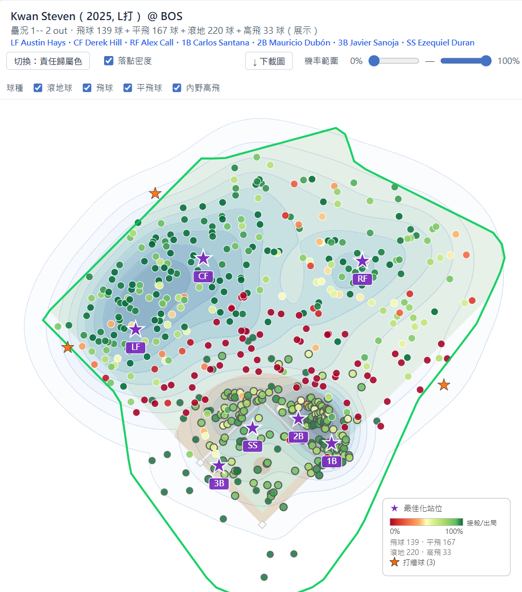
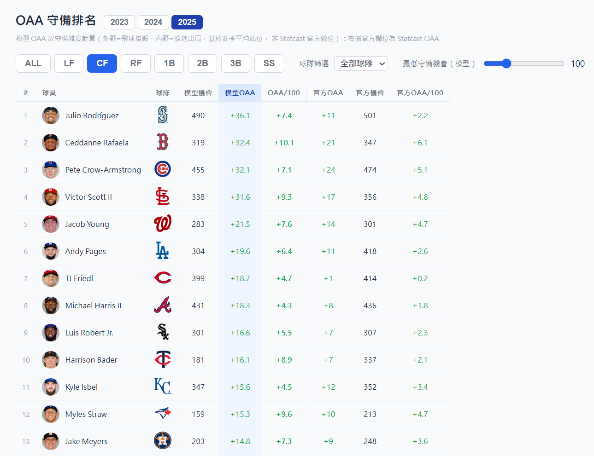

# MLB Lab — Defensive Positioning Optimizer

A full-stack web app that estimates MLB fielders' true defensive skill (Outs Above Average) from Statcast data and recommends optimal defensive positioning for any batter, base/out state, and (optionally) a chosen set of fielders.

**Live app:** https://baseball-defense-web.onrender.com
*(hosted on a free tier — first request after idling can take ~30–60s to wake up)*

## Why

MLB banned extreme infield shifts in 2023, which raised an obvious question defenses (and analysts) actually care about: for *this* batter, in *this* situation, what's the best *legal* positioning — and how much is the league's current positioning leaving on the table? Answering that requires (1) a model of how much a fielder's position actually affects the chance of an out, and (2) an optimizer that respects the real shift-legality rules, not just an unconstrained search. This project builds both, end to end, on public data.

## Pipeline

```
Statcast (pybaseball) → PostgreSQL → feature engineering → PyMC / scikit-learn models
                                                                    │
                                                     precomputed tables (Neon)
                                                                    │
                                              FastAPI ──────────────┘
                                                 │
                                          React + Vite frontend
```

Statcast play-by-play (2020–2025, 4.26M pitches) plus Baseball Savant's season-average fielder positioning and official OAA leaderboards are loaded into PostgreSQL, then turned into per-ball-in-play features (fielder distance/angle, hang time, runner speed, etc.).

## Two models, two jobs (the core design decision)

- **A "positioning" model** — used *only* for optimization. Deliberately excludes the ball's raw spray angle, because under standard alignment, season-average fielder position is close to a deterministic function of spray angle. If the optimizer could see spray angle, it would partly just be re-deriving today's alignment instead of reasoning about geometry — a form of information leakage that breaks the moment you move a fielder. It sees only real geometric relationships (fielder distance/angle to the ball) that remain valid *after* repositioning.
- **A "difficulty" model** — used *only* for evaluation/OAA. Free to use spray angle, exit velocity, etc., since evaluation doesn't require reasoning about a counterfactual defense.

This split matters because a single model trained to be maximally predictive would default to leaning on alignment-correlated features, which is exactly wrong for an optimizer meant to recommend *different* alignments.

**Outfield**: Bayesian hierarchical logistic regression (PyMC) — `speed + cos(angle) + sin(angle) + fielder_dist`, with player-level random effects. Out-of-sample R = 0.796 vs. official OAA (2025, n=89 qualified fielders).

**Infield ground balls**: a GLM on fielder geometry only. Out-of-sample R = 0.514 (n=158). Shortstop is the hardest position to evaluate (R≈0.31) — infield defense is far more sensitive to the fielder's *actual* starting spot on that specific play than outfield defense is, and the only positioning data available here is season averages, not per-play tracking (that requires proprietary Hawk-Eye data MLB doesn't release publicly).

## Positioning optimization

The objective is expected runs saved (via an RE24 table), minimized with an L-BFGS-B multistart search over the legal positioning region (polar-coordinate bounds per position; infielders can't cross the bag). Outfield optimization runs online (a fully vectorized NumPy objective, sub-second even on Render's 0.1-CPU free tier). Infield optimization is too slow to run per-request through an sklearn pipeline on that hardware, so it's precomputed offline per batter and refined online with a zero/low-restart local search around the precomputed solution when specific fielders are selected.

### Runner-on-first / double-play awareness

With a runner on first and fewer than two outs, a ground ball's value isn't just "out or not" — it's whether it becomes a double play. That situation gets its own two-stage model: P(at least one out) × P(double play | at least one out), with first base pinned to the league's standard "hold the runner" position (a rule-driven placement, not a free variable) while second, third, and shortstop are optimized. Cross-year validation found **97% of the positioning gain comes from adapting the geometry to the base-runner constraint, and only ~3% from double-play-aware pricing** — the recurring theme across this whole project: *where you stand* (geometry) matters far more than *how you price the outcome*.

## The web app

- **Home** (`/`) — pick a batter, year, base/out state, and stadium; see league-average vs. optimized positioning for all seven fielders (LF/CF/RF + 1B/2B/3B/SS) at once, with the double-play logic kicking in automatically when the situation calls for it. Optionally pin specific fielders to see the optimal positioning *for that lineup*. Side-by-side A/B compare mode for two situations/lineups at once.

  

- **Rankings** (`/rankings`) — model-derived OAA per position, year, and team, cross-referenced against MLB's official leaderboard.

  

## Results

| Model | Scope | Held-out accuracy |
|---|---|---|
| Outfield (combined LF/CF/RF) | 2025 season, out-of-sample | R = 0.796 vs. official OAA (n=89 qualified) |
| Infield ground balls | 2025 season, out-of-sample | R = 0.514 vs. official OAA (n=158 qualified) |
| Positioning gain, cross-year validation (no runners on) | trained 2023–24 → tested 2025 | +0.0156 expected outs/ball (≈ +7 outs per 450 balls), 95.3% of batters gain |
| Positioning gain, runner on 1st (double-play aware) | trained 2023–24 → tested 2025 | +0.0723 expected runs/ball, 100% of batters gain |


Full methodology, every ablation, and the reasoning behind each modeling choice are documented in [`ARCHITECTURE.md`](ARCHITECTURE.md).

## Engineering notes

- **Squeezing a 0.1-CPU free tier**: the outfield optimizer originally took 4+ minutes per request on Render's free plan. Getting it down to tens of seconds took several rounds of empirical tuning — restart count, warm-starting one call from a related call's solution, switching to Latin Hypercube sampling for restart points, loosening L-BFGS-B convergence tolerances — each one validated on 25–30 held-out batter samples against a high-restart "ground truth" before shipping, because a couple of these interact non-linearly (safe individually, unsafe stacked).
- **Known, disclosed limitations, not hidden ones**: model OAA runs ~2–3x larger in magnitude than official OAA (season-average positioning instead of per-play tracking inflates the estimated effect of positioning) — handled with cross-position centering rather than a false claim of scale-accuracy. Shortstop evaluation is the weakest link for the same underlying reason.
- **Testing/CI** — 90+ pytest unit/integration tests, GitHub Actions CI, full type coverage (mypy-clean) across `src/`, `api/`, `scripts/`.

## Running locally

```bash
# backend
pip install -r requirements.txt
python -m uvicorn api.main:app --port 8000

# frontend
cd frontend
npm install
npm run dev
```

Requires a local PostgreSQL database seeded via the pipeline in `ARCHITECTURE.md` (`scripts/fetch/` → `scripts/precompute/` → `scripts/train/`).

## Tech stack

Python · FastAPI · PostgreSQL · PyMC · scikit-learn · NumPy/SciPy · React · Vite · Render · Neon
