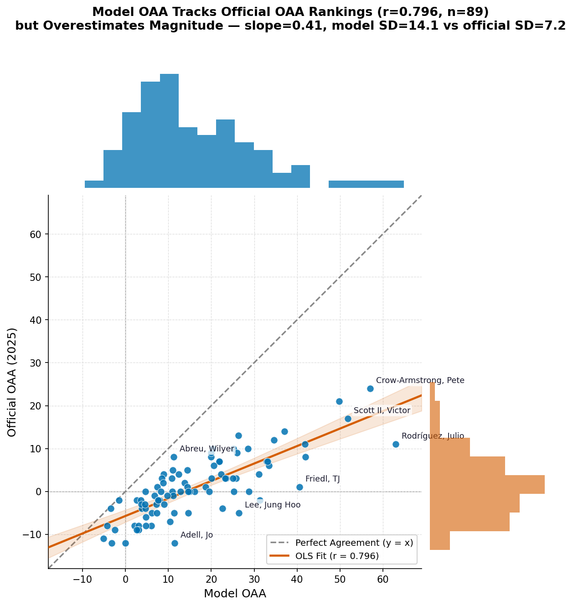

# MLB Lab — Defensive Positioning Optimizer

A full-stack web app that estimates MLB fielders' true defensive skill (Outs Above Average) from Statcast data and recommends optimal defensive positioning for any batter and game situation.

**Live app:** https://baseball-defense-web.onrender.com
*(hosted on a free tier — first request after idling can take ~30–60s to wake up)*

## What it does

1. **Catch/out probability models** — Bayesian hierarchical logistic regression (outfield) and GLMs (infield ground balls) estimate the probability that a given fielder converts a given batted ball into an out, based on the fielder's starting position, the ball's trajectory, and run-speed.
2. **Outs Above Average (OAA)** — each fielder's actual outs minus their model-expected outs, summed over a season, benchmarked against MLB's official OAA leaderboard.
3. **Positioning optimization** — for a chosen batter, base/out state, and (optionally) a specific set of fielders, an L-BFGS-B multistart optimizer searches fielder positions that minimize the batter's expected run value (RE24-based), subject to shift-legality constraints (infielders can't cross the bag; outfielders stay within realistic depth/angle bounds).

## Results

| Model | Scope | Held-out accuracy |
|---|---|---|
| Outfield (combined LF/CF/RF) | 2025 season, out-of-sample | R = 0.796 vs. official OAA (n=89 qualified) |
| Infield ground balls | 2025 season, out-of-sample | R = 0.514 vs. official OAA (n=158 qualified) |
| Positioning gain, cross-year validation (no runners on) | trained 2023–24 → tested 2025 | +0.0156 expected outs/ball (≈ +7 outs per 450 balls), 95.3% of batters gain |
| Positioning gain, runner on 1st (double-play aware) | trained 2023–24 → tested 2025 | +0.0723 expected runs/ball, 100% of batters gain |



Full methodology, ablations, and every experiment behind these numbers are documented in [`ARCHITECTURE.md`](ARCHITECTURE.md).

## Architecture

```
Statcast (pybaseball) → PostgreSQL → feature engineering → PyMC / scikit-learn models
                                                                    │
                                                     precomputed tables (Neon)
                                                                    │
                                              FastAPI ──────────────┘
                                                 │
                                          React + Vite frontend
```

- **Backend** — FastAPI (Python 3.13), PostgreSQL (local) / Neon (production). Optimization runs online for outfield (vectorized NumPy objective); infield relies on offline-precomputed base solutions refined online per fielder, since a per-request sklearn pipeline evaluation is too slow on a 0.1-CPU free-tier instance.
- **Models** — PyMC hierarchical Bayesian logistic regression for outfield catch probability (player-level random effects); scikit-learn GLMs for infield out probability, deliberately excluding raw spray angle to avoid baking in current defensive alignment (a counterfactual-validity requirement, since the whole point is predicting outcomes under *moved* positioning).
- **Frontend** — React 19 + Vite, no UI framework; SVG field renderings, canvas-based density plots.
- **Testing/CI** — 91+ pytest unit/integration tests, GitHub Actions CI, full type coverage (mypy-clean) across `src/`, `api/`, `scripts/`.

## Key engineering decisions

- **Two separate models per domain, not one** — a "positioning" model (fielder geometry only, no raw spray) used for optimization, and a separate "evaluation" model (spray, exit velo, no fielder info) used for scoring, to avoid the optimizer exploiting positional signal that only exists because of *today's* alignment.
- **OAA scale correction** — the model's absolute OAA values run 2–3x larger than official OAA (a byproduct of only having season-average fielder positions, not the actual per-play starting position). Handled via cross-position centering rather than claiming an unfixable absolute-value match.
- **Speed vs. free-tier compute** — positioning optimization runs an L-BFGS-B multistart search; the number of restarts, warm-starting, sampling strategy (Latin Hypercube vs. uniform), and convergence tolerances were each empirically tuned and validated against a 100+ restart "ground truth" on held-out batter samples before being deployed at reduced settings.

## Running locally

```bash
# backend
pip install -r requirements.txt
python -m uvicorn api.main:app --port 8000

# frontend
cd frontend
npm install
npm run dev
```

Requires a local PostgreSQL database seeded via the pipeline in `ARCHITECTURE.md` (`scripts/fetch/` → `scripts/precompute/` → `scripts/train/`).

## Tech stack

Python · FastAPI · PostgreSQL · PyMC · scikit-learn · NumPy/SciPy · React · Vite · Render · Neon
